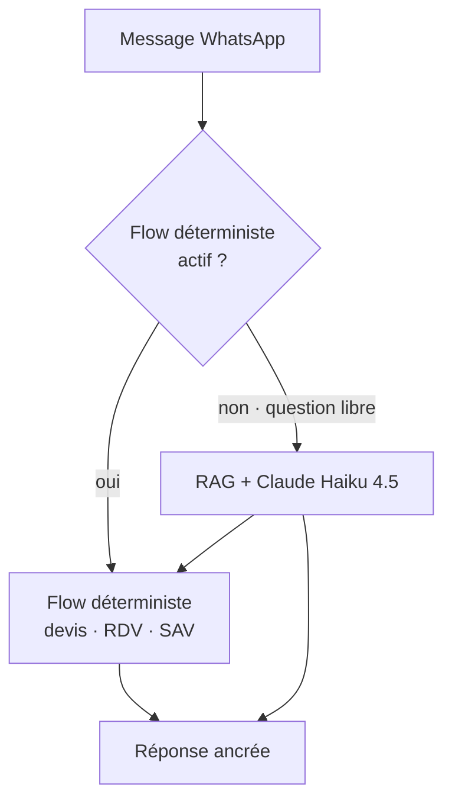
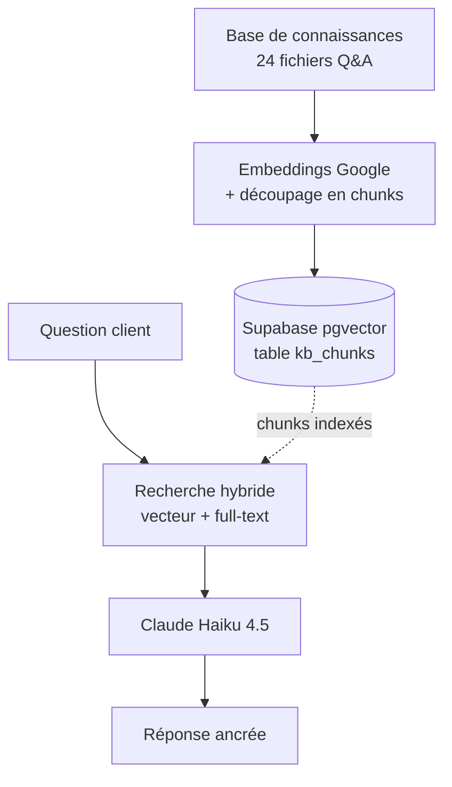
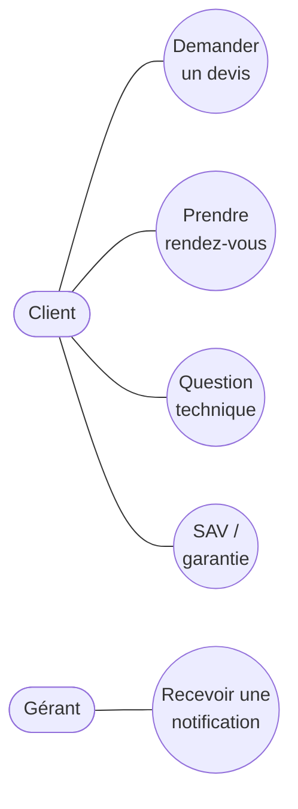
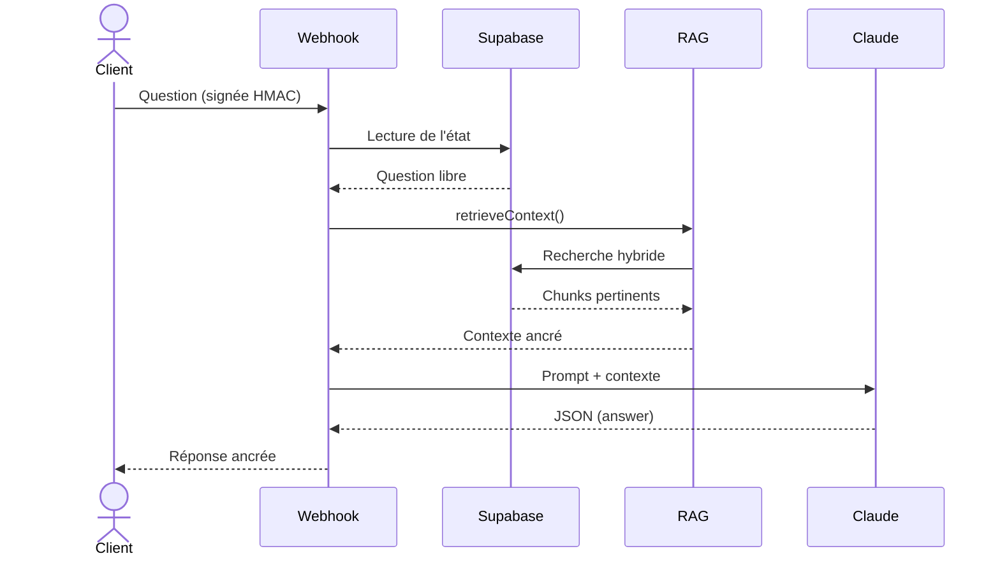
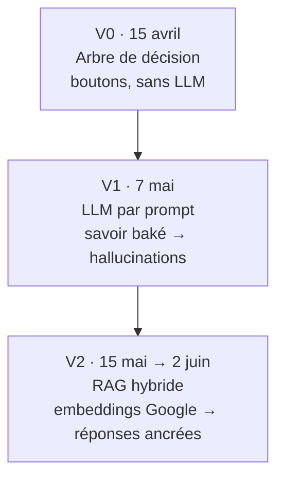
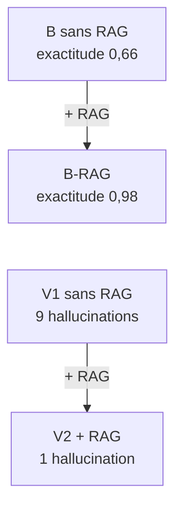

# Figures Mermaid — Mémoire ING2 (De l'API au RAG)

> Diagrammes épurés (labels courts) pour rester lisibles en portrait ; le détail technique
> est dans le texte (sections 4.1 à 4.3). Blocs dans l'ordre d'extraction fig1…fig6.
> Rendus en PNG haute résolution puis insérés dans le .docx.

---

## fig1 — Figure 1 : Pipeline global de traitement d'un message (V2)



---

## fig2 — Figure 3 : Architecture RAG (vue d'ensemble)



---

## fig3 — Figure 4 : Cas d'utilisation (UML)



---

## fig4 — Figure 5 : Séquence — du message à la réponse ancrée (UML)



---

## fig5 — Figure 2 : Évolution itérative de l'assistant (V0 → V1 → V2)



---

## fig6 — Figure 7 : Deux lectures des résultats



---

## Figure 6 : Résultats du benchmark (graphique matplotlib → figs/fig_resultats.png)

| Condition | Exactitude | Hallucinations | Déterministe |
|---|---|---|---|
| A-V1 — baké, sans RAG | 0,77 | 9/31 | 81 % |
| A-V2 — baké + RAG | 0,97 | 1/31 | 90 % |
| B-noRAG — dépouillé, sans RAG | 0,66 | 0/31 | 48 % |
| B-RAG — dépouillé + RAG | 0,98 | 0/31 | 94 % |
```
