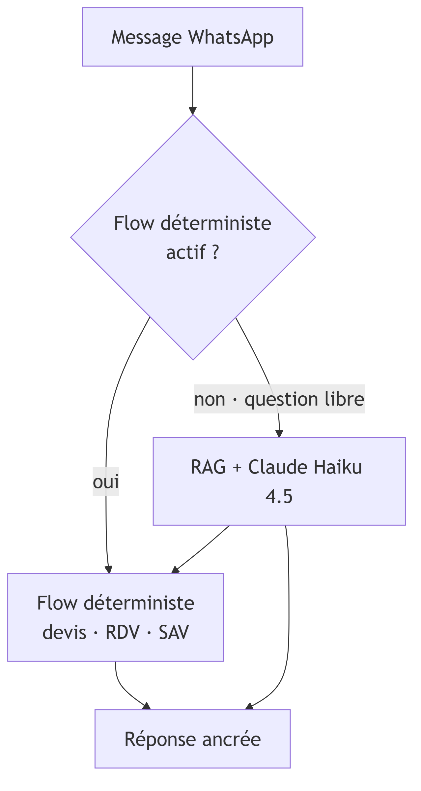
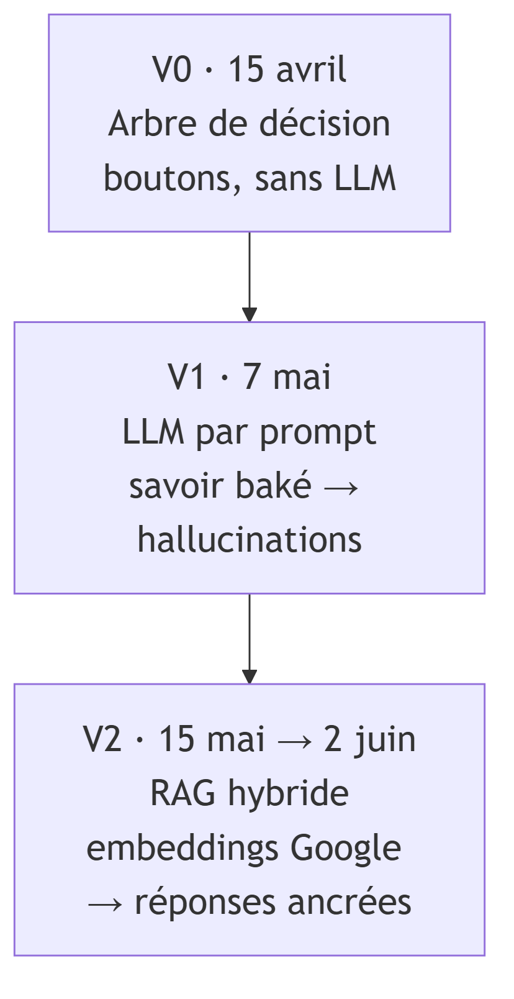
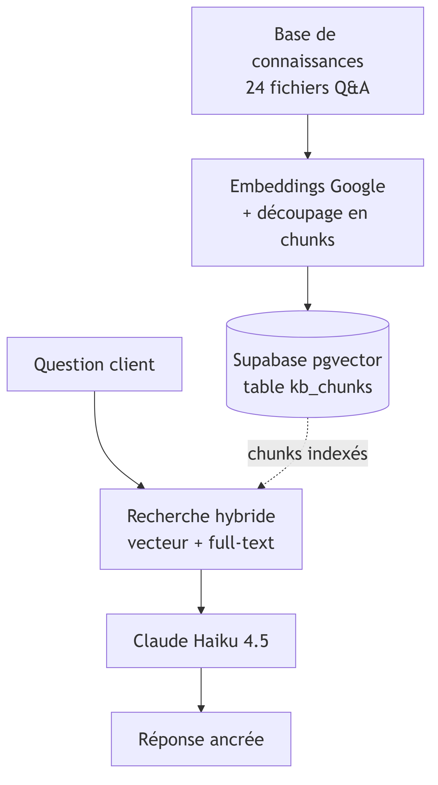
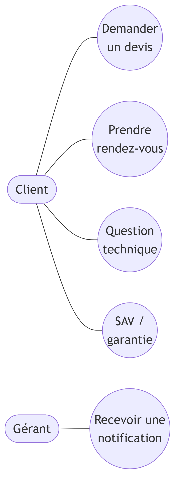
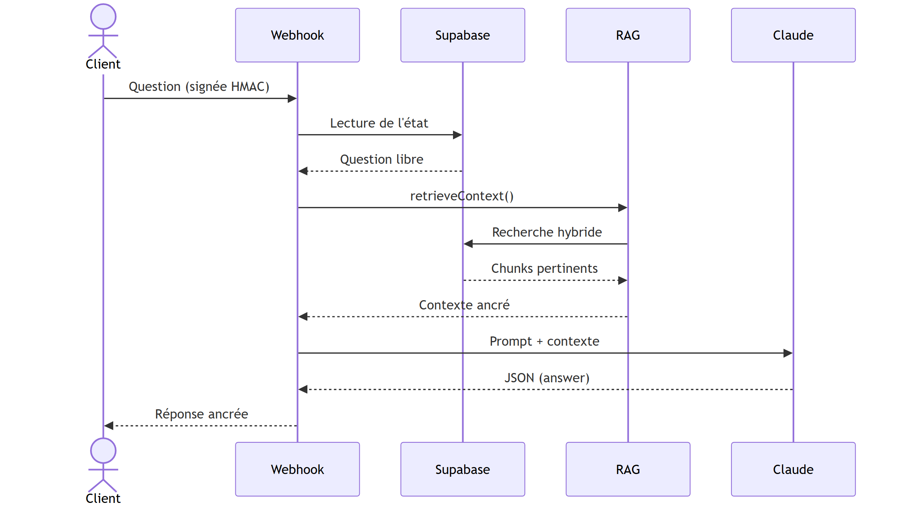
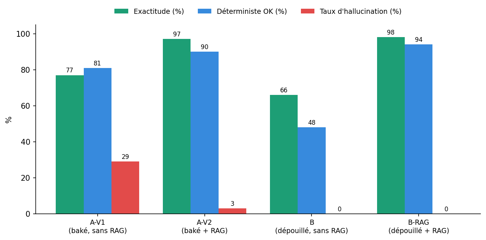
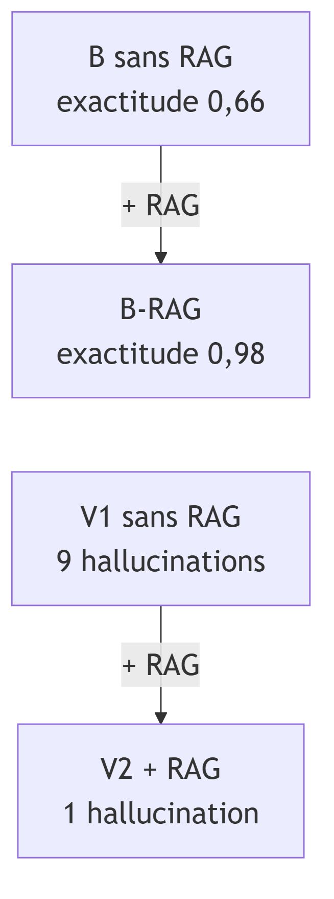

# De l'API au RAG : conception d'un assistant conversationnel fiable pour la relation client d'une PME du secteur automobile

**Cas d'étude : Diagperf — automatisation du traitement des demandes clients**

Hischem HAMMOUDI — Promotion ING2, Majeure Big Data & Machine Learning
EFREI Paris — Programme Grande École — Mémoire de fin d'année, Alternance ING2
Année universitaire 2025-2026

- Tuteur pédagogique (EFREI) : Antoine MILES
- Tuteur entreprise (Diagperf) : Youcef ZAID
- Entreprise : Diagperf — Villenoy (77)

---

> **État de rédaction.** Document de travail en markdown ; conversion finale en .docx
> (Calibri 12, interligne 1,25, sommaire automatique, pagination). Les figures Mermaid sont
> dans `figures.md`. Les sections sont rédigées dans l'ordre : artefacts bornés (tableau,
> biblio) → cœur (3 État de l'art, 4 Étude originale) → cadrage (1, 2) → conclusion → résumé.

---

## Remerciements

Je tiens à remercier l'ensemble de l'équipe de Diagperf pour son accueil et sa confiance tout
au long de cette alternance, ainsi que mon tuteur entreprise, Youcef ZAID,
pour son accompagnement et la liberté laissée dans la conduite de ce projet. Je
remercie également mon tuteur pédagogique, Antoine MILES, pour son suivi
et ses conseils, ainsi que l'EFREI Paris pour le cadre de cette formation. Mes remerciements
vont enfin à toutes les personnes qui, par leurs retours, ont contribué à l'amélioration de
l'assistant.

## Résumé

L'essor des modèles de langage (LLM) rend l'automatisation de la relation client accessible aux
PME, mais en expose la principale fragilité : l'hallucination, c'est-à-dire la production de
réponses fausses énoncées avec assurance. Ce mémoire traite ce risque sur un cas réel —
Diagperf, garage de reprogrammation et de diagnostic automobile débordé par des demandes
clients récurrentes (devis, rendez-vous, questions techniques). La problématique est de
concevoir un assistant conversationnel **fiable**, capable d'automatiser ces demandes sans
produire d'information erronée. La solution a été construite de façon itérative : d'un arbre de
décision rigide à un LLM par prompt — qui comprend le langage mais invente les faits — puis à
une architecture de **génération augmentée par récupération (RAG)**, ancrant chaque réponse
dans une base de connaissances métier vectorisée. L'apport du RAG est mesuré par un benchmark
contrôlé à quatre conditions : l'ablation isole un gain d'exactitude de 0,66 à 0,98, et une
chute des hallucinations de neuf à zéro lorsque la connaissance est entièrement externalisée du
prompt. Le mémoire en tire une recommandation d'ingénierie — placer les faits dans la base, non
dans le prompt — et en discute honnêtement les limites.

**Mots-clés** : LLM, RAG, relation client, PME, chatbot.

## 1. Introduction générale

### 1.1 Contexte

Depuis la diffusion grand public des modèles de langage de grande taille (LLM) à partir de
2022-2023, des outils auparavant réservés à la recherche sont devenus accessibles à toute
organisation via de simples appels d'API. Cette démocratisation ouvre, pour les petites et
moyennes entreprises (PME), une opportunité concrète : automatiser des tâches de communication
jusque-là entièrement manuelles, au premier rang desquelles la relation client.

Diagperf, l'entreprise d'accueil de cette alternance, illustre ce besoin. Il s'agit d'un garage
spécialisé dans la reprogrammation moteur et le diagnostic électronique automobile, situé à
Villenoy (77124), près de Meaux. Son activité dominante combine le **diagnostic électronique**
et la **conversion à l'éthanol (E85)**, dans des proportions variables selon la saison, ainsi
que la reprogrammation (Stage 1) et les prestations de dépollution (suppression FAP, EGR,
AdBlue). L'équipe, réduite à trois personnes, reçoit ses demandes clients principalement par
**téléphone**, à un rythme estimé de l'ordre d'une à quatre demandes par jour : devis,
prises de rendez-vous et questions techniques (compatibilité E85, codes défauts, antipollution).
Chaque échange, entre la prise d'appel, la vérification d'une compatibilité ou d'un tarif et la
réponse, mobilise un temps non négligeable — estimé à plusieurs dizaines de minutes cumulées par
jour — au détriment du travail à l'atelier. Ces ordres de grandeur sont des estimations de
terrain : le dispositif n'étant pas encore déployé, ils ne reposent pas sur une mesure
instrumentée. C'est pour décharger l'équipe de ce traitement répétitif, et offrir une réponse
immédiate au client, qu'a été engagé le projet d'un assistant conversationnel sur WhatsApp —
objet du présent mémoire.

### 1.2 Problématique, objectifs et contributions

La difficulté n'est pas d'automatiser la conversation — un LLM le permet aisément — mais de le
faire **sans trahir la confiance du client** : dans ce métier, un prix erroné ou une
compatibilité fausse annoncés avec assurance sont plus dommageables qu'une absence de réponse.
D'où la problématique :

> **Comment concevoir un assistant conversationnel fiable pour une PME automobile, capable
> d'automatiser le traitement des demandes clients (devis, rendez-vous, questions techniques)
> tout en restant ancré dans la connaissance métier et sans produire d'informations erronées ?**

Cette problématique se décline en trois questions de recherche :

- **QR1** — Comment traiter des demandes clients variées, formulées en langage naturel, sans
  retomber dans la rigidité des systèmes à règles ni dans les ruptures de conversation ?
- **QR2** — La génération augmentée par récupération (RAG) réduit-elle effectivement les
  hallucinations factuelles par rapport à un LLM sollicité par simple prompt, dans un contexte
  de PME disposant de peu de données ?
- **QR3** — Où placer la connaissance métier — figée dans le prompt système ou externalisée
  dans une base interrogeable — pour maximiser à la fois l'exactitude et la maintenabilité ?

Les **contributions** du travail sont : (i) la conception et la mise en œuvre d'un assistant
WhatsApp complet, du webhook à la génération ancrée ; (ii) la formalisation de la connaissance
métier de Diagperf en une base documentaire vectorisée ; (iii) un **protocole d'évaluation
contrôlé à quatre conditions**, mesurant l'apport du RAG toutes choses égales par ailleurs ;
et (iv) une recommandation d'ingénierie, étayée par les mesures, sur le placement de la
connaissance.

### 1.3 Méthodologie et structure du mémoire

La démarche est une **conception itérative**, dont chaque étape répond à une limite observée sur
la précédente : un arbre de décision déterministe (V0), puis un LLM par prompt (V1), enfin une
architecture RAG (V2). L'apport du RAG est quantifié par un benchmark **avant/après** sur un jeu
de questions représentatives, incluant des cas réels de défaillance. Le mémoire suit le plan
imposé : la section 2 pose le problème et son contexte ; la section 3 dresse l'état de l'art des
approches d'automatisation conversationnelle ; la section 4 présente l'étude originale — la
conception du pipeline et son évaluation chiffrée ; la section 5 conclut sur les apports et les
perspectives.

## 2. Position du problème

### 2.1 Description du contexte

Diagperf est une PME du secteur automobile spécialisée dans l'optimisation et le diagnostic
électronique. Son catalogue couvre la reprogrammation moteur (Stage 1), la conversion à
l'éthanol (E85), la suppression des systèmes de dépollution (FAP, EGR, AdBlue) et le diagnostic
de pannes, auxquels s'ajoutent des prestations annexes (CarPlay, traitement céramique, alarme).
L'entreprise, implantée à Villenoy (77124) et composée de trois personnes, garantit deux ans
sur ses prestations et revendique la couverture de plus de 24 000 motorisations. Son activité
connaît une **saisonnalité** marquée : la demande de conversion E85 s'intensifie lorsque le
prix des carburants grimpe, tandis que le diagnostic électronique constitue un socle d'activité
plus régulier sur l'année. La demande la plus fréquente porte ainsi, selon la saison, sur les
**devis et la compatibilité E85** et sur le **diagnostic** ; les questions de reprogrammation et
de dépollution viennent ensuite.

Si le volume reste modeste — de l'ordre d'une à quatre demandes par jour — chaque demande est à
**forte intensité de conseil** : elle suppose de vérifier une compatibilité véhicule, d'annoncer
un tarif exact, ou d'interpréter un symptôme ou un code défaut. Or, dans ce métier, une erreur
n'est pas anodine : un prix erroné ou une compatibilité fausse annoncés au client se traduisent
par une perte de confiance, voire par un litige. La qualité de la réponse prime donc sur sa seule
rapidité.

Mon rôle, en tant qu'alternant **Data Analyst & Automatisation** (depuis février 2026), a
consisté à concevoir et développer l'assistant conversationnel qui fait l'objet de ce mémoire.
Le constat initial qui le motive est double. D'une part, les demandes arrivent majoritairement
par **téléphone**, un canal synchrone qui interrompt le travail à l'atelier, ne laisse aucune
trace exploitable et perd les appels manqués — autant d'affaires potentiellement perdues. D'autre
part, leur traitement est **répétitif** : une part importante des échanges porte sur un petit
ensemble de questions récurrentes (prix d'une prestation, compatibilité E85 d'un modèle,
signification d'un voyant) dont les réponses sont stables et documentables. Ces deux
caractéristiques — un canal mal adapté et un contenu répétitif mais factuel — désignent un
terrain favorable à l'automatisation, à la condition expresse que celle-ci soit fiable. Le canal
retenu est **WhatsApp** : déjà familier des clients, asynchrone, traçable, et adossé à une API
officielle (Meta WhatsApp Cloud API) qui permet une intégration logicielle propre.

Une analyse des échanges récurrents fait apparaître une **typologie** stable de demandes, que
l'assistant doit couvrir : (i) les questions **tarifaires** (prix d'une prestation ou d'une
option) ; (ii) les questions de **compatibilité** (un véhicule est-il éligible à l'E85, au
Stage 1, à une suppression de dépollution ?) ; (iii) le **diagnostic** (interprétation d'un
voyant, d'un code défaut OBD-II, d'un symptôme) ; (iv) les demandes **transactionnelles**
(établir un devis, prendre un rendez-vous) ; et (v) le **service après-vente** (garantie, suivi
post-prestation). Les trois premières catégories sont purement factuelles et documentables —
donc directement automatisables par une réponse ancrée ; les deux dernières supposent une action
ou une prise en charge, déléguées aux flux déterministes (section 4.1).

### 2.2 Formalisation de la problématique

Au-delà du cas Diagperf, le problème relève d'une **classe** plus générale : déployer un
assistant fondé sur un LLM dans une PME caractérisée par (i) **peu de données structurées** —
excluant les approches gourmandes en corpus — et (ii) une **exigence d'exactitude métier**
élevée, où l'erreur factuelle a un coût de confiance immédiat. Quatre enjeux structurent ce
problème :

- la **fiabilité factuelle** : prévenir les hallucinations, c'est-à-dire les réponses fausses
  énoncées avec assurance, qui constituent le risque principal [14] ;
- la **maintenabilité** : la connaissance (tarifs, compatibilités) évolue et doit pouvoir être
  mise à jour sans expertise technique ni réentraînement ;
- le **coût** : l'addition des appels d'API doit rester soutenable pour une petite structure ;
- la **confidentialité** : les échanges contiennent des données personnelles (coordonnées,
  plaques), dont le traitement doit être maîtrisé.

Ce dernier enjeu mérite une attention particulière. L'assistant collecte et traite des **données
à caractère personnel** au sens du RGPD : numéro WhatsApp, nom, coordonnées, plaque
d'immatriculation et, indirectement, des informations sur le véhicule du client. Trois principes
guident sa conception sur ce plan : la **minimisation** — ne demander que les données strictement
nécessaires à la production d'un devis ou d'un rendez-vous ; la **maîtrise de l'hébergement** —
l'état conversationnel et la base de connaissances résident dans une base Supabase à accès
contrôlé ; et la **non-réutilisation à des fins d'entraînement** — les échanges clients ne
servent pas à entraîner de modèle, le générateur étant un service tiers appelé sans rétention à
cette fin. Ces choix relèvent autant de la conformité que de la confiance, ressource première
d'une PME de proximité.

La réussite se mesure donc moins à la fluidité de la conversation qu'à la **proportion de
réponses exactes et ancrées**, et symétriquement à la **rareté des informations erronées**.

### 2.3 Périmètre et hypothèses de travail

**Ce que l'assistant doit faire** : répondre aux questions factuelles récurrentes (prix,
compatibilités, horaires, codes défauts), orienter vers la bonne prestation, amorcer la
production d'un devis et la prise de rendez-vous, et transmettre les demandes de SAV. **Ce
qu'il ne doit pas faire** : engager l'entreprise sur un fait qu'il ignore (il doit alors
renvoyer vers un devis personnalisé ou l'équipe), ni traiter les cas hors périmètre (boîtes
automatiques, véhicules électriques), qu'il se borne à décliner en orientant le client.

Le travail repose sur trois hypothèses : (H1) la connaissance métier de Diagperf est
**documentable** dans des fichiers structurés ; (H2) le canal d'interaction reste **WhatsApp** ;
(H3) un **modèle commercial** par API (sans hébergement de LLM en propre) est suffisant et
adapté à l'échelle de la PME.

## 3. État de l'art
### 3.1 Fondamentaux des modèles de langage

Un modèle de langage (Language Model, LM) est un modèle statistique qui attribue une
probabilité à une séquence de mots et, par extension, prédit le mot le plus vraisemblable
à la suite d'un contexte donné. Les modèles de langage de grande taille (Large Language
Models, LLM) reposent sur l'architecture *Transformer* introduite par Vaswani et al. [1],
dont le mécanisme d'*attention* permet de pondérer les relations entre tous les mots d'une
séquence sans dépendance récurrente, autorisant un entraînement massivement parallèle. Cette
architecture a rendu possible le passage à l'échelle : pré-entraînés de façon auto-supervisée
sur d'immenses corpus textuels, des modèles comme BERT [2] puis GPT-3 [3] ont montré qu'au-delà
d'un certain volume de paramètres, les LLM acquièrent des capacités de généralisation
remarquables, y compris en apprentissage *few-shot*, c'est-à-dire à partir de quelques
exemples fournis dans la requête [3].

Trois notions techniques sont nécessaires à la compréhension de la suite du mémoire.
Le **token** est l'unité élémentaire que manipule le modèle : un fragment de mot, un mot ou
un signe de ponctuation ; la facturation des API commerciales et la taille de la *fenêtre de
contexte* (le volume de texte que le modèle peut traiter en une fois) se comptent en tokens.
L'**embedding** est la représentation d'un texte sous forme de vecteur numérique de dimension
fixe, construit de sorte que deux textes sémantiquement proches aient des vecteurs proches au
sens d'une distance (typiquement le cosinus) ; les modèles de type Sentence-BERT [9] produisent
de tels vecteurs pour des phrases entières, fondement de la recherche sémantique. Enfin,
l'**hallucination** désigne la production, par un LLM, d'un énoncé fluide et plausible mais
factuellement faux ou non fondé sur une source [14] ; c'est le risque central pour une
application où l'exactitude prime, comme la relation client d'un garage.

Le comportement d'un LLM peut être orienté sans modifier ses poids, par la seule formulation
de la requête : c'est l'*ingénierie de prompt*. L'alignement sur des instructions via
apprentissage par renforcement à partir de retours humains (RLHF) [4] et des techniques comme
le *Chain-of-Thought* [5], qui invite le modèle à expliciter son raisonnement, améliorent la
qualité des réponses, mais ne créent aucun ancrage factuel : le modèle reste tributaire des
connaissances figées dans ses poids au moment de l'entraînement.

### 3.2 Approches d'automatisation conversationnelle

Quatre familles d'approches permettent d'automatiser le traitement de demandes clients en
langage naturel, auxquelles s'ajoute une cinquième, transverse, l'orchestration par agents.

#### 3.2.1 Chatbots à règles et arbres de décision

Les premiers agents conversationnels reposent sur des règles écrites manuellement :
correspondances de mots-clés, motifs syntaxiques et arbres de décision guidant l'utilisateur,
souvent via des boutons. Leur principal atout est le **déterminisme** : le comportement est
entièrement prévisible, le coût d'exécution est négligeable et aucune hallucination n'est
possible, puisque le système ne génère rien qu'il n'ait été programmé à dire. Cette robustesse
explique leur omniprésence dans les systèmes de support de première ligne. Leur limite est
toutefois rédhibitoire dès que l'on quitte le script : ne comprenant pas le langage naturel,
ils échouent sur toute formulation imprévue et renvoient l'utilisateur à un menu d'accueil,
provoquant une rupture de l'échange. C'est précisément le comportement de la première version
de l'assistant Diagperf (cf. section 4.2), et la motivation initiale du recours aux LLM.

#### 3.2.2 LLM par prompt et appel API

L'approche la plus directe pour exploiter un LLM consiste à appeler une API commerciale
(Anthropic, OpenAI) en injectant, dans le *prompt système*, à la fois les instructions de
comportement et la connaissance métier (tarifs, prestations, règles de compatibilité). Le
modèle comprend alors la variété des formulations et répond en langage naturel, ce qui lève la
rigidité des approches à règles. Le déploiement est rapide et ne requiert ni base de données
spécialisée ni réentraînement. Cette approche souffre néanmoins de trois limites structurelles.
D'abord, les **hallucinations** : sollicité sur un fait absent ou imprécis dans son prompt, le
modèle tend à inventer une réponse plausible plutôt qu'à s'abstenir [14] — un prix erroné
énoncé avec assurance est plus nuisible qu'une absence de réponse. Ensuite, le **savoir figé
et coûteux à maintenir** : toute évolution tarifaire impose de modifier le prompt et de
redéployer ; le prompt grossit et finit par saturer la fenêtre de contexte. Enfin, le **coût
par requête**, proportionnel au volume de tokens traités. La section 4.5 quantifie ces limites
sur le cas Diagperf : la version par prompt seul produit une information fausse sur près d'un
tiers des questions.

#### 3.2.3 Retrieval-Augmented Generation (RAG)

La génération augmentée par récupération, ou RAG, formalisée par Lewis et al. [6], dissocie la
**connaissance** de la **génération**. Au lieu d'enfermer les faits dans les poids ou dans le
prompt, on les conserve dans une base documentaire externe, interrogée à chaque requête ; les
passages pertinents sont récupérés puis injectés dans le contexte du LLM, qui rédige une
réponse fondée sur ces extraits. Une architecture RAG combine ainsi deux composants : un
*retriever* (récupérateur) et un *generator* (le LLM).

Le retriever repose sur la recherche sémantique : les documents sont préalablement découpés en
*chunks* (fragments), chacun converti en embedding [9] et stocké dans une base vectorielle. À
l'exécution, la requête est elle-même vectorisée, et l'on recherche les chunks dont le vecteur
est le plus proche — un problème de plus proche voisin résolu efficacement, à grande échelle,
par des index approximés tels que HNSW [11] ou des bibliothèques comme FAISS [12]. La
recherche dense par passages (DPR) [8] a montré la supériorité de cette approche vectorielle
sur la seule correspondance lexicale pour les questions ouvertes ; en pratique, une recherche
**hybride** combinant similarité vectorielle et appariement lexical de type BM25 [10] offre le
meilleur compromis, en capturant à la fois la proximité sémantique et les termes techniques
exacts (codes défauts, références moteur).

L'intérêt décisif du RAG pour notre problème est la **réduction des hallucinations** : en
ancrant la génération dans des passages sourcés, on contraint le modèle à répondre à partir de
faits vérifiables plutôt que de sa mémoire paramétrique. Shuster et al. [13] établissent
expérimentalement que l'augmentation par récupération diminue significativement les
hallucinations en dialogue. S'y ajoutent deux bénéfices opérationnels majeurs pour une PME : la
**maintenabilité** — mettre à jour un tarif revient à éditer un fichier source, sans
réentraînement — et la **traçabilité** des réponses. La synthèse de Gao et al. [7] recense les
nombreuses variantes (RAG naïf, avancé, modulaire) et confirme que la qualité finale dépend
avant tout de celle du retriever et des sources documentaires.

#### 3.2.4 Fine-tuning (LoRA, QLoRA)

Le *fine-tuning* (affinage) consiste à poursuivre l'entraînement d'un modèle pré-entraîné sur
un corpus propriétaire afin d'en modifier les poids. Les méthodes d'affinage à faible coût,
comme LoRA [15], qui n'entraîne qu'un petit nombre de paramètres additionnels de faible rang,
et son extension quantifiée QLoRA [16], ont rendu l'opération accessible sur du matériel
modeste. Le fine-tuning excelle à internaliser un **style**, un format de sortie ou un
**comportement** récurrent, sans récupération à l'exécution. Il est en revanche mal adapté à la
**connaissance factuelle** : celle-ci reste figée dans les poids et se périme à chaque
évolution tarifaire, imposant un réentraînement. Surtout, il exige un corpus d'exemples
conséquent et étiqueté, dont une PME comme Diagperf ne dispose pas. La distinction est désormais
classique : le RAG pour les **faits** qui changent, le fine-tuning pour le **comportement** qui
se stabilise. Notre étude exploite d'ailleurs ce principe (cf. section 4.5) : en déplaçant tout
le savoir métier du prompt vers la base RAG, on obtient la meilleure exactitude *sans* aucun
affinage.

#### 3.2.5 Agents et orchestration

Une dernière famille, transverse, dote le LLM de la capacité d'**agir** : au-delà de la réponse
textuelle, le modèle décide d'appeler des outils (créer un devis, vérifier un agenda, envoyer
un email). Des cadres comme ReAct [17], qui entrelace raisonnement et actions, ou Toolformer
[18], par lequel le modèle apprend à invoquer des API, illustrent cette orientation. Pour
Diagperf, l'agentivité représente une **perspective d'évolution** naturelle — automatiser de
bout en bout la production d'un devis ou la prise de rendez-vous — mais accroît la complexité,
la surface d'erreur et la difficulté de garantir un comportement sûr ; elle est donc tenue hors
du périmètre de la première mise en production (cf. sections 4.7 et 5.3).
### 3.3 Positionnement de Diagperf et synthèse comparative

Le tableau ci-dessous synthétise les cinq grandes approches d'automatisation conversationnelle
au regard du cas Diagperf : une PME disposant de peu de données structurées, mais d'un fort
besoin d'exactitude métier (un prix ou une compatibilité erronés détruisent la confiance client).

| Approche | Principe | Avantages | Limites | Pertinence Diagperf |
|---|---|---|---|---|
| **Chatbot à règles / arbre de décision** | Scripts, mots-clés et boutons prédéfinis ; aucun modèle de langage. | Déterministe, prévisible, coût quasi nul, aucune hallucination possible. | Rigide ; ne comprend pas le langage naturel ; toute question hors-script provoque une rupture (retour à l'accueil). | Point de départ réel (V0) ; insuffisant dès qu'un client formule une question libre. |
| **LLM via prompt + appel API** | Le savoir métier est injecté dans le *prompt système* ; une API (Anthropic, OpenAI) génère la réponse. | Déploiement rapide ; compréhension fine du langage ; gère la variété des formulations. | Hallucinations confiantes ; pas d'ancrage factuel ; savoir figé et coûteux à maintenir ; fenêtre de contexte limitée. | Étape V1 ; améliore la conversation mais produit des prix/compatibilités faux (mesuré : 29 % d'hallucinations). |
| **RAG (Retrieval-Augmented Generation)** | Une base de connaissances vectorisée est interrogée à chaque requête ; les passages pertinents sont injectés avant génération. | Réponses ancrées dans les documents ; hallucinations fortement réduites ; mise à jour = éditer un fichier, sans réentraînement. | Dépend de la qualité du *retriever* et des sources ; surcoût d'infrastructure (base vectorielle) ; latence de récupération. | **Solution retenue (V2)** ; adaptée à une PME : peu de données, besoin d'exactitude, maintenance simple. |
| **Fine-tuning (LoRA / QLoRA)** | Adaptation des poids du modèle sur un corpus propriétaire. | Internalise un style/comportement ; pas de récupération à l'exécution. | Nécessite un corpus conséquent et étiqueté ; coûteux ; le savoir factuel reste figé et se périme. | Peu adapté : Diagperf a trop peu de données ; utile au plus pour le *ton*, pas les faits. |
| **Agents / orchestration** | Le LLM décide d'appeler des outils (créer un devis, vérifier un agenda, envoyer un email). | Automatise des actions de bout en bout ; dépasse la simple réponse. | Complexité, surface d'erreur et coût accrus ; difficulté de contrôle et de garanties. | Perspective d'évolution (devis/RDV automatiques) ; hors périmètre de la première mise en production. |

## 4. Étude originale : conception et mise en œuvre de l'assistant
### 4.1 Vue d'ensemble de la solution

L'assistant a été conçu de façon **itérative**, en trois temps que l'historique de versions
permet de dater précisément (figure 2) : une version V0 à arbre de décision (15 avril 2026),
une version V1 fondée sur un appel direct au LLM (7 mai 2026), puis la version V2 à
architecture RAG (15 mai – 2 juin 2026). Cette progression n'est pas qu'anecdotique : chaque
transition répond à une limite concrète constatée sur la précédente, et structure la
démonstration du mémoire.

L'architecture finale (figure 1) est **hybride**. Un message WhatsApp entrant est d'abord
authentifié par vérification de signature HMAC-SHA256, puis l'état de la conversation est
chargé depuis la base. Si un *flow déterministe* est actif — une machine à états guidant la
production d'un devis ou un ticket de SAV (`WAITING_PLATE → … → devis → RDV`) — il est
poursuivi. Sinon, et notamment pour toute question libre, la requête est confiée à la fonction
`askLLM`, qui met en œuvre le RAG. Le modèle ne renvoie jamais du texte libre directement :
il produit un **objet JSON** typé (`{"type": "answer" | "intent" | "route", …}`) qui indique
soit une réponse à transmettre, soit l'intention de (re)basculer vers un flow déterministe.
Cette discipline de sortie structurée concilie la souplesse conversationnelle du LLM et le
contrôle des actions sensibles (création de devis, prise de coordonnées), conformément aux
bonnes pratiques d'outillage des agents [17].

### 4.2 Version 1 — Assistant par appel API (Anthropic)

La première version conversationnelle injecte l'intégralité du savoir métier — grille
tarifaire, règles de compatibilité, codes défauts — dans le **prompt système**, puis délègue
la génération à l'API Anthropic (Claude). Elle lève l'écueil majeur de la V0 à boutons :
le modèle comprend enfin les formulations libres. Trois défaillances, observées en conditions
réelles, ont néanmoins motivé le passage au RAG.

D'abord, la **rupture de conversation**. La V0 à boutons, et dans une moindre mesure la V1,
échouent à traiter une question libre formulée à un moment inattendu. Les captures d'écran
recueillies (annexes) en donnent trois illustrations distinctes : une question de réassurance
posée pendant le choix d'un *stage* renvoie « Merci de choisir un des stages proposés » ; une
question vague (« Est-ce que je peux rouler tranquillement ? ») déclenche un « Je n'ai pas
bien saisi votre message » et un retour à l'accueil ; et, dans l'état d'attente de plaque
d'immatriculation, une question de compatibilité (« reprog moteur pour un véhicule
essence ? ») est interprétée comme une plaque illisible (« Je n'ai pas reconnu la plaque »).
Ces trois cas, intégrés au jeu de test (cf. section 4.5, cas RC01–RC03), incarnent la limite
des approches non conversationnelles.

Ensuite, les **hallucinations factuelles**. Le savoir étant figé dans un long prompt, le modèle
le paraphrase, le généralise indûment ou le périme : une règle propre à la conversion E85
(« essence uniquement ») déborde par exemple sur la reprogrammation Stage 1, conduisant le
modèle à affirmer à tort qu'un moteur diesel n'est pas éligible (cf. section 4.5). La
section 4.5 quantifie ce phénomène : la configuration par prompt seul produit une information
fausse sur près d'un tiers des questions.

Enfin, la **perte du contexte conversationnel** : la V1 historique interdisait explicitement
l'usage de l'historique pour interpréter une intention, cassant les questions de suivi
(« et pour le mien ? », « et ce code ? »). La V2 s'appuie au contraire activement sur
l'historique.

### 4.3 Version 2 — Architecture RAG

#### 4.3.1 Préparation et indexation de la connaissance métier

La connaissance métier de Diagperf a été formalisée dans une **base documentaire** de 24
fichiers Markdown au format question-réponse, organisés en quatre catégories : `services`
(reprogrammation, E85, suppressions FAP/EGR/AdBlue, options), `faq` (fiabilité, contrôle
technique, garantie, compatibilités, codes défauts), `infos` (localisation, horaires, processus
de rendez-vous, contact) et `tarifs` (grille complète). Le choix du format Q-R, adopté le
2 juin 2026, vise à aligner la forme des documents sur celle des requêtes clients, ce qui
améliore les scores de récupération.

L'indexation (figure 3), réalisée hors-ligne par le module `ingest.js`, découpe les documents
en *chunks*, calcule pour chacun un **embedding de 384 dimensions** via l'API Google
`gemini-embedding-001` (avec le paramètre `taskType = RETRIEVAL_DOCUMENT`), et les stocke dans
une base **Supabase (PostgreSQL + extension pgvector)**, table `kb_chunks`, dotée d'un index
`ivfflat` pour la similarité cosinus et d'un index `GIN` sur un vecteur `tsvector` pour la
recherche plein-texte française. Un choix d'architecture mérite d'être souligné : le projet a
**migré d'embeddings locaux** (modèle `all-MiniLM-L6-v2`) **vers l'API Google** le 18 mai 2026,
les embeddings locaux « accrochant » mal sur le vocabulaire technique francophone ; en revanche,
le générateur est resté Claude tout au long du projet. Cette distinction — migration des
*embeddings*, stabilité du *générateur* — est essentielle à la juste lecture de l'évaluation.

Le **découpage en chunks** épouse la structure question-réponse des fichiers : chaque paire Q-R
forme une unité sémantique cohérente, ce qui évite de fragmenter une réponse entre deux chunks
et améliore la pertinence de la récupération. Chaque chunk conserve les **métadonnées** issues
de l'en-tête du fichier (catégorie, intention, tags), réexploitées pour le filtrage et le
*boost*. La table `kb_chunks` matérialise ce modèle :

| Colonne | Type | Rôle |
|---|---|---|
| `content` | TEXT | Texte du chunk (la paire question-réponse) |
| `embedding` | VECTOR(384) | Représentation vectorielle (similarité cosinus) |
| `fts_content` | TSVECTOR | Index plein-texte français (recherche lexicale) |
| `category` / `intent` / `tags` | TEXT / TEXT[] | Métadonnées de filtrage et de *boost* |
| `file_path` / `chunk_index` | TEXT / INT | Traçabilité vers le fichier source |

Deux index soutiennent la recherche hybride : un index **`ivfflat`** (`vector_cosine_ops`) sur
`embedding` pour la similarité vectorielle, et un index **GIN** sur `fts_content` pour le
plein-texte — ce dernier maintenu à jour par un *trigger* à chaque insertion. La dimension de
384 a par ailleurs été **conservée lors de la migration** des embeddings locaux vers Google,
afin de préserver le schéma et les index existants : seul le producteur d'embeddings a changé,
pas l'espace vectoriel cible.

#### 4.3.2 Pipeline de récupération et de génération

À chaque question libre, le module `rag.js` exécute la chaîne suivante (figure 3). La requête est d'abord enrichie par **expansion de synonymes** français/anglais
(par exemple `reprog → reprogrammation, tuning, remap, stage`), afin de couvrir les abréviations
techniques. Elle est ensuite vectorisée (`taskType = RETRIEVAL_QUERY`, pour aligner l'espace
de la requête sur celui des documents), puis soumise à une **recherche hybride** via la
procédure stockée `match_kb_chunks_hybrid`, qui combine similarité vectorielle cosinus et
appariement plein-texte (pondération configurable, 0,3 pour le lexical). Les résultats sont
**reclassés** : un *boost* est appliqué aux chunks correspondant à l'intention courante de la
conversation, les doublons sont éliminés, et seuls les meilleurs passages sont conservés. Le
contexte ainsi constitué (plafonné à ~4 800 caractères) est injecté dans un bloc système dédié,
en amont de l'appel à **Claude Haiku 4.5** (REST `/v1/messages`, température 0,2, `max_tokens`
900, *prompt caching* activé pour amortir le coût du prompt statique, et ré-essai automatique
sur erreurs transitoires). Le modèle répond enfin au format JSON décrit en 4.1.

Le **score de pertinence** d'un chunk combine les deux signaux selon la formule mise en œuvre
dans la procédure stockée :

> *score = (1 − w) · similarité_cosinus + w · rang_lexical · 10*, avec *w = 0,3*.

La procédure **sur-récupère** (le double du nombre cible) pour laisser de la marge au
reclassement applicatif ; celui-ci applique un *boost* de 1,25 aux chunks dont l'intention
correspond à la conversation en cours, élimine les doublons, puis ne retient que les huit
meilleurs passages (seuil de similarité 0,45), tronqués à environ 4 800 caractères avant
injection.

**Exemple déroulé** — pour la question « c'est combien la reprog stage 1 ? » : (1) l'expansion
ajoute les synonymes *reprogrammation, tuning, remap, stage, puissance, couple* ; (2) la requête
enrichie est vectorisée (`RETRIEVAL_QUERY`) ; (3) la recherche hybride conjugue proximité
vectorielle et appariement lexical sur « stage », « prix », « reprog », et remonte en tête le
chunk de `tarifs/grille-tarifaire.md` contenant « Stage 1 : 390€ TTC (< 400 ch et < 2018) » ;
(4) ce passage, accompagné de quelques chunks voisins (compatibilité, options), est injecté dans
le bloc système ; (5) Claude rédige une réponse ancrée — « Le Stage 1 est à 390€ TTC… » — au
format JSON `{"type":"answer", …}`. C'est cette chaîne qui distingue une réponse fondée sur un
fait vérifiable d'une réponse produite de mémoire.

#### 4.3.3 Modélisation conceptuelle (UML)

Le diagramme de cas d'utilisation (figure 4) distingue deux acteurs — le **client** final et le
**gérant** Diagperf — autour des cas principaux : demander un devis, prendre rendez-vous, poser
une question technique ou tarifaire, signaler un problème en SAV (côté client) ; recevoir une
notification de nouvelle demande et consulter le tableau de bord (côté gérant). Le diagramme de
séquence (figure 5) déroule le traitement d'une question libre, du message reçu jusqu'à la
réponse ancrée : vérification de signature, lecture de l'état, récupération RAG (expansion,
embedding, recherche hybride sur pgvector), génération par Claude, puis envoi via l'API
WhatsApp.

### 4.4 Environnement technique

Le tableau suivant récapitule la pile technique et justifie chaque choix.

| Brique | Technologie | Justification |
|---|---|---|
| Exécution | Node.js + Express 5 (CommonJS) | Écosystème léger, adapté à un webhook événementiel ; déploiement simple. |
| Canal | Meta WhatsApp Cloud API | Canal déjà utilisé par les clients ; webhook signé (HMAC-SHA256). |
| Génération | Claude Haiku 4.5 (API Anthropic) | Bon rapport qualité/coût/latence pour un volume modeste ; sortie JSON fiable. |
| Embeddings | Google `gemini-embedding-001` (384 dim) | Multilingue, performant sur le français technique (après migration depuis un modèle local). |
| Base vectorielle | Supabase (PostgreSQL + pgvector) | Recherche vectorielle et plein-texte dans une même base gérée ; coût maîtrisé. |
| Vocal | Groq Whisper | Transcription des messages vocaux clients. |
| Emails / PDF | Brevo (HTTP) ; pdfkit | Envoi des devis ; génération du PDF de devis. |
| Supervision | Sentry | Capture des erreurs en production. |
| Hébergement | Render | Déploiement continu depuis le dépôt Git. |
| Frontend | PWA (tableau de bord) | Suivi des demandes côté gérant. |

### 4.5 Résultats et évaluation

**Protocole.** L'assistant n'étant pas encore déployé en production, l'évaluation est un
**benchmark hors-ligne contrôlé** plutôt qu'une mesure terrain. Un jeu de 31 questions a été
constitué : 28 questions ancrées sur la base de connaissances (couvrant prix, compatibilités,
codes défauts, informations pratiques, objections et questions de suivi) et 3 cas réels
transcrits des captures d'écran de bugs (RC01–RC03, cf. section 4.2). Chaque question est passée
dans **quatre conditions**, croisant deux facteurs — le contenu du prompt et la présence du RAG :

- **A-V1** : prompt historique (savoir baké), *sans* RAG — la version V1 réelle ;
- **A-V2** : prompt actuel complet (savoir baké) *avec* RAG — la version livrée ;
- **B-noRAG** : prompt *dépouillé* de tout fait métier, *sans* RAG ;
- **B-RAG** : prompt dépouillé *avec* RAG.

Ce plan autorise deux lectures complémentaires : le couple (A-V1 → A-V2) raconte l'évolution
réelle du système, tandis que le couple (B-noRAG → B-RAG) **isole l'effet causal pur du RAG**,
toutes choses égales par ailleurs (seule la présence du RAG varie). Le modèle générateur est
Claude Haiku 4.5 dans les quatre conditions. L'évaluation combine un **contrôle déterministe**
(présence des faits attendus, absence des faits interdits) et un **juge LLM** — un second
modèle, Claude Opus 4.8, notant l'exactitude (0 / 0,5 / 1) et signalant les hallucinations au
regard d'une vérité-terrain ; le recours à un modèle-juge suit la méthodologie « LLM-as-a-judge »
de Zheng et al. [19] ; l'évaluation automatisée de la qualité des systèmes RAG fait par ailleurs
l'objet de cadres dédiés [20]. Le choix d'un juge plus puissant que le modèle évalué limite le
biais d'auto-complaisance. Les métriques retenues sont l'exactitude, le taux d'hallucination, la
réussite déterministe, la latence et le coût.

**Résultats** (run du 17 juin 2026, juge Opus 4.8) :

| Condition | Exactitude | Hallucinations | Déterministe | Latence p50 |
|---|---|---|---|---|
| A-V1 — prompt baké, sans RAG | 0,77 | **9 / 31 (29 %)** | 81 % | 2553 ms |
| A-V2 — prompt baké + RAG (livré) | 0,97 | 1 / 31 | 90 % | 2048 ms |
| B-noRAG — dépouillé, sans RAG | 0,66 | 0 / 31 | 48 % | 1963 ms |
| B-RAG — dépouillé + RAG | **0,98** | **0 / 31** | **94 %** | 1968 ms |

Trois enseignements se dégagent. **Premièrement, l'effet causal du RAG est important et net** :
à prompt dépouillé identique, l'ajout du RAG fait passer l'exactitude de 0,66 à 0,98 et la
réussite déterministe de 48 % à 94 % (figure 6). **Deuxièmement, le RAG améliore nettement le système
réel** : entre la V1 et la V2, l'exactitude progresse de 0,77 à 0,97 et le nombre
d'hallucinations chute de 9 à 1 — et ce sans surcoût, la V2 étant même plus rapide et moins
chère grâce au *prompt caching*. **Troisièmement, la meilleure configuration n'est pas celle
livrée** : la condition B-RAG (prompt dépouillé + RAG) atteint la plus haute exactitude (0,98)
avec **zéro hallucination**, surpassant la V2 livrée (1 hallucination). Ce résultat fonde une
recommandation d'ingénierie concrète, discutée ci-dessous.

**Analyse par catégorie.** L'apport du RAG n'est pas uniforme. En comparant la version sans RAG
(A-V1) à la version pleinement ancrée (B-RAG), famille de questions par famille :

| Famille de questions | A-V1 (sans RAG) | B-RAG (avec RAG) |
|---|---|---|
| Tarifs | 0,75 | 1,00 |
| Compatibilité / périmètre | 0,81 | 1,00 |
| Codes défauts / diagnostic | 1,00 | 1,00 |
| Informations / objections | 0,82 | 0,95 |
| Suivi (questions contextuelles) | 0,33 | 1,00 |

Le RAG apporte le plus là où la connaissance est **propre à Diagperf** — tarifs, compatibilités —
et, de façon spectaculaire, sur les **questions de suivi** (0,33 → 1,00), c'est-à-dire les cas de
rupture de conversation. À l'inverse, sur les **codes défauts OBD-II**, les deux conditions sont
parfaites : cette connaissance étant générale et déjà bien maîtrisée par le modèle, le RAG n'y
ajoute rien. La valeur du RAG se concentre donc sur le **savoir métier spécifique et changeant**,
non sur les connaissances techniques générales — un constat cohérent avec la distinction
faits / comportement de la section 3.2.4.

**Illustrations.** Deux échanges résument les défaillances corrigées. Sur une hallucination de
compatibilité (« Stage 1 sur un 2.0 TDI, ça marche ? »), la version sans RAG répond à tort
« *le Stage 1, c'est notre spécialité en reprogrammation essence ; sur un 2.0 TDI diesel, on ne
fait pas* », là où la version ancrée confirme justement « *Le Stage 1 fonctionne très bien sur
les moteurs turbo diesel comme le 2.0 TDI* ». Sur une rupture de conversation (« Est-ce que je
peux rouler tranquillement ? »), la version historique renvoie un message vide — un retour au
menu — tandis que la version ancrée engage : « *Votre question est un peu large ! Pouvez-vous me
donner plus de contexte — un souci sur le véhicule, une question après une prestation ?* ».

### 4.6 Discussion et comparaison avec les approches existantes

Replacés dans l'état de l'art (section 3), ces résultats (synthétisés figure 7) confirment empiriquement, sur un cas
PME, la propriété centrale du RAG : l'ancrage documentaire réduit les hallucinations [6][13].
Ils nuancent toutefois l'idée que le RAG « réglerait tout », par trois observations honnêtes.

**Baker la connaissance dans le prompt peut activement tromper.** La condition A-V1, qui
concentre 9 hallucinations, n'échoue pas par manque d'information mais par *interférence* : les
règles s'y contaminent mutuellement (la règle « E85 = essence uniquement » fait répondre, à
tort, qu'un Stage 1 est impossible sur un diesel). Les conditions à prompt dépouillé, qui ne
« savent » rien hors du contexte récupéré, évitent cet écueil.

**Le savoir baké peut entrer en conflit avec le RAG.** La version livrée (A-V2) conserve
une hallucination résiduelle parce que les faits figés dans son prompt peuvent entrer en
concurrence avec le contexte récupéré, conduisant le modèle à sur-affirmer là où la base
nuançait. C'est précisément pourquoi B-RAG, dont le prompt ne contient *aucun* fait et s'en
remet entièrement au RAG, n'hallucine jamais (zéro). **Recommandation** : sortir l'intégralité des prix et règles de
compatibilité du prompt système pour les confier exclusivement à la base RAG — une évolution à
la fois plus exacte, moins chère et plus simple à maintenir (un tarif se met à jour en éditant
un fichier).

**La rupture de conversation est corrigée au niveau du LLM.** Sur les trois cas réels
(RC01–RC03), là où la V0/V1 renvoyait au menu ou demandait de reformuler, les conditions RAG
répondent à la question ou posent une question de clarification pertinente — le comportement
attendu d'un assistant fiable.

### 4.7 Conditions d'application et limites

La solution est transposable à toute PME dont la connaissance métier peut être documentée dans
des fichiers et dont les demandes transitent par un canal conversationnel : sa valeur croît avec
le besoin d'exactitude factuelle et la fréquence des mises à jour. Plusieurs limites doivent
être assumées. L'évaluation est un **benchmark hors-ligne** : faute de déploiement, elle ne
mesure pas la satisfaction client réelle ni les volumes effectifs. Le **juge LLM** demeure
faillible — le recours à un juge Opus, plus discriminant que le juge Haiku initial, a d'ailleurs
révélé des erreurs de notation du premier — et le contrôle déterministe, strict, produit des
faux négatifs ; les deux mesures convergent néanmoins sur la hiérarchie des conditions. La
qualité des réponses reste **bornée par celle des sources** : une base incomplète ou erronée se
répercute sur la génération. Enfin, certains cas restent **hors périmètre** (boîtes
automatiques, véhicules électriques), correctement déclinés par l'assistant mais non traités sur
le fond. Les pistes d'amélioration — agents outillés pour le devis et le rendez-vous, extension
multilingue, affinage du ton — sont développées en section 5.3.

## 5. Conclusion

### 5.1 Synthèse

Ce mémoire est parti d'un besoin concret — décharger une PME automobile du traitement répétitif
de ses demandes clients — et d'une exigence non négociable : ne jamais produire d'information
erronée. À cette problématique, la réponse construite est un assistant conversationnel WhatsApp
dont la conception a suivi trois temps : un arbre de décision déterministe, vite limité par sa
rigidité ; un LLM par prompt, qui restaure la compréhension du langage mais hallucine sur les
faits ; enfin une architecture **RAG**, qui ancre chaque réponse dans une base de connaissances
métier interrogée à la volée.

Le résultat principal est mesuré : sur un benchmark contrôlé à quatre conditions, le RAG fait
passer l'exactitude de 0,66 à 0,98 toutes choses égales par ailleurs, et réduit les
hallucinations de la version par prompt de neuf à une, voire à zéro lorsque la connaissance est
entièrement externalisée. Ce dernier point apporte une réponse directe à la troisième question
de recherche : la connaissance factuelle doit être **sortie du prompt** et confiée à la base
RAG — un choix à la fois plus exact, moins coûteux et plus simple à maintenir. Le travail
confirme ainsi, sur un cas PME réel, la valeur de l'ancrage documentaire pour la fiabilité des
assistants conversationnels, tout en en montrant honnêtement les limites.

### 5.2 Apports professionnels et montée en compétences

Cette mission a été l'occasion d'une montée en compétences sur deux plans. Sur le plan
**technique** : la conception d'un pipeline RAG de bout en bout (chunking, embeddings, base
vectorielle pgvector, recherche hybride), l'intégration d'API tierces (WhatsApp Cloud API,
Anthropic, Google), le déploiement continu, la supervision en production, et surtout une
démarche d'**évaluation rigoureuse** (protocole d'ablation, juge LLM). Sur le plan
**transverse** : la conduite d'un projet en autonomie de la V0 à la mise en production, la
traduction d'un besoin métier flou en spécifications, et la prise en compte de la relation
client comme critère de conception.

Ces acquis se laissent reporter, compétence par compétence, sur la grille du livret iziA.

**Bloc 2 — Compétences techniques et savoir-faire métier.**

- *2.1 Analyser les besoins.* Le besoin diffus de Diagperf a été formalisé en une problématique
  et un périmètre explicites (sections 2.2 et 2.3), puis en exigences techniques ; la faisabilité
  a été établie en arbitrant les contraintes propres à une PME — d'où le choix d'un modèle par
  API plutôt qu'un hébergement de LLM en propre (H3).
- *2.2 Concevoir des solutions fondées sur l'état de l'art.* L'architecture RAG a été modélisée
  en composants découplés (indexation / récupération / génération, figures 1 et 3) ; les
  technologies ont été **sélectionnées et justifiées** (embeddings Google, pgvector, Claude
  Haiku — section 4.4) ; des **objectifs de qualité et des KPI** ont été définis (exactitude,
  taux d'hallucination, latence, coût — section 4.5) ; des **mécanismes de sécurité et de
  fiabilité** ont été intégrés (signature HMAC, abstention anti-hallucination, ré-essais) ;
  l'**évolutivité et l'interopérabilité** ont été préparées (architecture modulaire, perspective
  d'agents) ; enfin, le **prototypage itératif** V0 → V1 → V2 traduit une montée progressive en
  maturité (TRL).
- *2.3 Mettre en œuvre des solutions numériques.* La solution a été **développée** de façon
  robuste (machine à états, sortie JSON contrôlée, gestion d'erreurs) ; de nombreux
  **composants ont été intégrés** (WhatsApp Cloud API, Anthropic, Google, Supabase, Brevo,
  Groq, Sentry) ; un dispositif de **tests fonctionnels** a été conçu et exécuté (le benchmark
  à quatre conditions) ; la solution a été **déployée** en continu (Render) et **documentée**
  (base de connaissances, README, et le présent mémoire).
- *2.4 Gérer l'exploitation dans une démarche d'amélioration continue.* Des **indicateurs de
  qualité** ont été définis et suivis (exactitude, taux d'hallucination, latence, coût —
  section 4.5), la supervision étant assurée en production par Sentry ; l'**environnement
  d'exploitation a été sécurisé** (vérification de signature HMAC, limitation de débit,
  durcissement contre les abus) et soumis à une **campagne de tests** avant mise en service
  (le benchmark), le suivi post-déploiement restant à mener une fois le dispositif en
  production ; enfin, la **documentation d'installation et d'exploitation** est fournie et
  tenue à jour (base de connaissances, fichiers de configuration, README de déploiement).

**Bloc 1 — Savoir-être et compétences transverses.** La conduite du projet en autonomie a
mobilisé l'organisation du travail selon une démarche itérative versionnée (1.8), la production
d'une documentation à jour (1.9), la prise en compte du budget et des ressources via la maîtrise
du coût d'API — *prompt caching*, modèle économique (1.7) —, l'attention à l'impact du numérique
par la réduction du volume de tokens et le choix d'un petit modèle (1.4), le respect d'un
référentiel de qualité au travers d'un protocole d'évaluation rigoureux (1.6), et l'adaptation
de la communication au client final, notamment par le vouvoiement systématique et un ton adapté
(1.2).

### 5.3 Perspectives

Trois axes d'évolution se dégagent. Le premier est l'**agentivité** [17][18] : doter
l'assistant d'outils pour produire un devis ou réserver un créneau de bout en bout, dépassant la
simple réponse — au prix d'un contrôle accru des actions sensibles. Le deuxième est
l'**extension multilingue** (français/arabe), pertinente pour la clientèle locale. Le troisième
est l'**affinage du ton** par fine-tuning léger [15][16], une fois la connaissance factuelle
stabilisée dans le RAG : conformément à la distinction faits/comportement, le RAG porterait
l'exactitude et le fine-tuning la voix de la marque. À plus long terme, la modularité de
l'architecture la rend **généralisable** à d'autres PME dont la connaissance métier est
documentable.

## 6. Bibliographie

> 20 références réelles. Format homogène ; appel dans le texte par [n].

1. VASWANI, A., SHAZEER, N., PARMAR, N., et al. *Attention Is All You Need*. Advances in Neural Information Processing Systems (NeurIPS), 2017.
2. DEVLIN, J., CHANG, M.-W., LEE, K., TOUTANOVA, K. *BERT: Pre-training of Deep Bidirectional Transformers for Language Understanding*. NAACL-HLT, 2019.
3. BROWN, T., MANN, B., RYDER, N., et al. *Language Models are Few-Shot Learners*. NeurIPS, 2020.
4. OUYANG, L., WU, J., JIANG, X., et al. *Training Language Models to Follow Instructions with Human Feedback*. NeurIPS, 2022.
5. WEI, J., WANG, X., SCHUURMANS, D., et al. *Chain-of-Thought Prompting Elicits Reasoning in Large Language Models*. NeurIPS, 2022.
6. LEWIS, P., PEREZ, E., PIKTUS, A., et al. *Retrieval-Augmented Generation for Knowledge-Intensive NLP Tasks*. NeurIPS, 2020.
7. GAO, Y., XIONG, Y., GAO, X., et al. *Retrieval-Augmented Generation for Large Language Models: A Survey*. arXiv:2312.10997, 2023.
8. KARPUKHIN, V., OĞUZ, B., MIN, S., et al. *Dense Passage Retrieval for Open-Domain Question Answering*. EMNLP, 2020.
9. REIMERS, N., GUREVYCH, I. *Sentence-BERT: Sentence Embeddings using Siamese BERT-Networks*. EMNLP, 2019.
10. ROBERTSON, S., ZARAGOZA, H. *The Probabilistic Relevance Framework: BM25 and Beyond*. Foundations and Trends in Information Retrieval, 2009.
11. MALKOV, Y. A., YASHUNIN, D. A. *Efficient and Robust Approximate Nearest Neighbor Search Using Hierarchical Navigable Small World Graphs*. IEEE Transactions on Pattern Analysis and Machine Intelligence, 2020.
12. JOHNSON, J., DOUZE, M., JÉGOU, H. *Billion-Scale Similarity Search with GPUs*. IEEE Transactions on Big Data, 2019.
13. SHUSTER, K., POFF, S., CHEN, M., et al. *Retrieval Augmentation Reduces Hallucination in Conversation*. Findings of EMNLP, 2021.
14. JI, Z., LEE, N., FRIESKE, R., et al. *Survey of Hallucination in Natural Language Generation*. ACM Computing Surveys, 2023.
15. HU, E. J., SHEN, Y., WALLIS, P., et al. *LoRA: Low-Rank Adaptation of Large Language Models*. ICLR, 2022.
16. DETTMERS, T., PAGNONI, A., HOLTZMAN, A., ZETTLEMOYER, L. *QLoRA: Efficient Finetuning of Quantized LLMs*. NeurIPS, 2023.
17. YAO, S., ZHAO, J., YU, D., et al. *ReAct: Synergizing Reasoning and Acting in Language Models*. ICLR, 2023.
18. SCHICK, T., DWIVEDI-YU, J., DESSÌ, R., et al. *Toolformer: Language Models Can Teach Themselves to Use Tools*. NeurIPS, 2023.
19. ZHENG, L., CHIANG, W.-L., SHENG, Y., et al. *Judging LLM-as-a-Judge with MT-Bench and Chatbot Arena*. NeurIPS, 2023.
20. ES, S., JAMES, J., ESPINOSA-ANKE, L., SCHOCKAERT, S. *RAGAS: Automated Evaluation of Retrieval Augmented Generation*. EACL (System Demonstrations), 2024.

## Annexes

Hors décompte des 25-50 pages. À insérer en fin de document :

- **Annexe A** — Prompts système V1 (historique) et V2 (actuel), avec la grille tarifaire (`benchmark/prompts.js`, `lib/llm-service.js`).
- **Annexe B** — Jeu de test du benchmark : les 31 questions, vérité-terrain et métadonnées de notation (`benchmark/questions.json`).
- **Annexe C** — Résultats détaillés par question et par condition (`benchmark/results/`).
- **Annexe D** — Captures d'écran des conversations : bugs V0/V1 (rupture, plaque non reconnue) et réponses V2 ancrées.
- **Annexe E** — Extraits de code clés : pipeline RAG (`rag.js`), indexation (`ingest.js`), machine à états (`flows/`).
